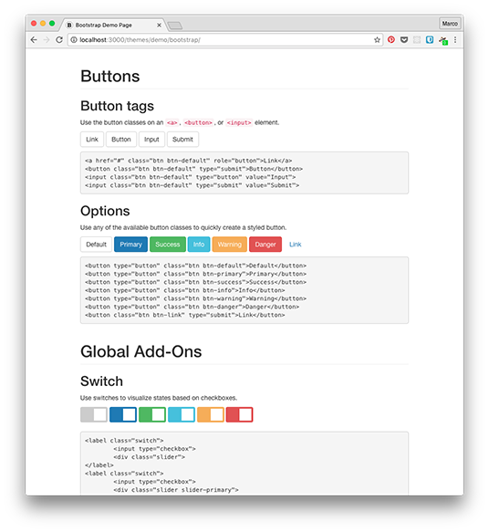
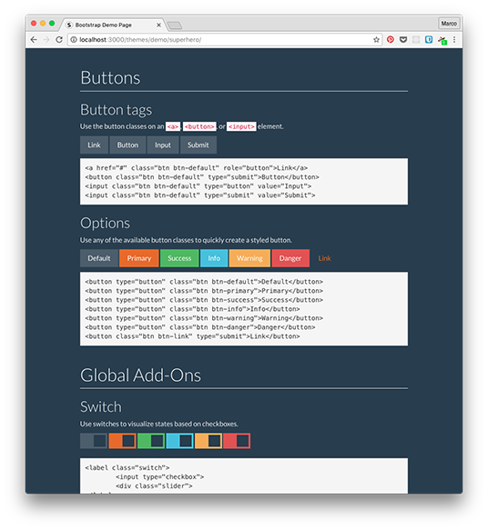
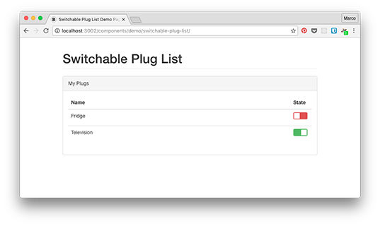
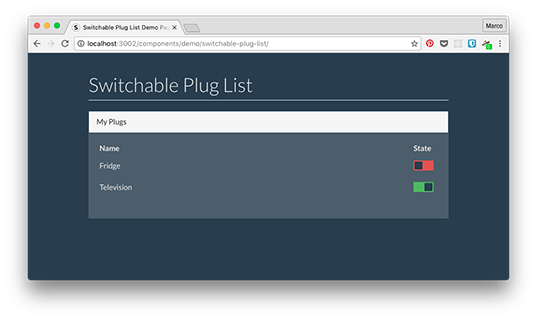

# Themeable Web Components

> Prototypical implementation of a three-tier theming workflow for web components

## Prerequisites

Install development and production dependencies.

```shell
$ npm install
```

## Basic principles

1. Themes have to stay compatible to underlying CSS framework.

This means the theme developer isn’t allowed to change the internal structure nor to add CSS rules based on tag
names. There are exactly three extensions points described in section _Patch Bootstrap_.

2. Components are theme-agnostic.

This means they are not allowed to use any build-time assets like `.less` files. Otherwise they would potentially
break the theme CSS rules which should apply to the components markup by inheritance. There are use cases in which
the component might want to know which concrete values are used in the currently active theme – e.g. for SVG elements
created programmatically (see CSS usage for SVG [here](https://developer.mozilla.org/en-US/docs/Web/Guide/CSS/Getting_started/SVG_and_CSS)).
But components have to rely on CSS classes only if they want to be theme-compatible. In justified cases its totally
possible to ignore the underlying theme and define CSS rules in the component context. Be aware that your CSS rules
are specific enough – by using the components name as CSS prefix for instance – so that other parts of an application
using the component are not interfered.

3. Apps are theme-agnostic.

This means they are not allowed to use any build-time assets like `.less` files. Otherwise they would potentially
break the theme CSS rules which should apply to the application markup by inheritance. The application has to be
understood as frame of configured components placed in a certain grid. Visually there should be only a few valid
use cases there the application has to overwrite theme-specific CSS rules by purpose.

## Theme developer

As theme developer I want to have an efficient way of patching the used CSS framework. Ideally the theme developer
has the possibility to decide whether to view his work on a demo page or effective in any public available application
by using a proxy server, which rewrites the theme CDN paths to the local directory.

Base path: `themes`

### Theme development

#### Copy Bootstrap

Copy Bootstrap sources into theme folders under `themes/demo/`.

```shell
$ ./themes/scripts/copy-bootstrap.sh
```

#### Patch Bootstrap

Patch path to `variables.less` in `less/bootstrap.less` for all themes unequal to `bootstrap` leading to
`themes/demo/*/theme/variables.less`.

```shell
$ ./themes/scripts/patch-bootstrap.sh
```

There are exactly three ways of patching Bootstrap

1. change variables in `src/<theme>/variables.less`
2. implement global add-on in `src/_global/add-ons.less`
3. implement theme-specific add-on in `src/<theme>/add-ons.less`

Be aware that global add-ons have to use as much variables as possible. Whereas theme-specific add-ons should use
variables but are allowed to define own property values because the add-on is only available and included in the
specific theme.

#### Build Bootstrap

Build Bootstrap by updating CSS and JavaScript in `dist` folder of each theme.

```shell
$ ./themes/scripts/build-bootstrap.sh
```

#### Publish themes

Publish themes by copying assets to `themes/cdn/` folder.

```shell
$ ./themes/scripts/publish-themes.sh
```

#### Demo page

View demo page with live reload capabilities. The command starts a web server on port 3000 serving `themes/demo`
as base directory. You can now easily switch between the defined themes by modifying the URL or clicking on the
directory names.

```shell
$ npm run theme:demo
```




### Theme distribution

Themes are distributed as a potentially patched Bootstrap theme, favicons and other necessary assets like fonts.
Of course the CDN has to provide semantic versioning like explained for [NPM](https://docs.npmjs.com/misc/semver).

#### Theme CDN server

The command starts a web server on port 3001 serving `themes/cdn` as base directory.

```shell
$ npm run theme:cdn
```

_TODO_

* Replace relative paths inside of CSS files by absolute paths

## Component developer

As component developer I want to have an efficient way of creating components and test them with different themes.
Therefore the npm theme:cdn command is executed to deliver the theme assets referenced in each components demo page.

Base path: `components`

### Component development

#### Demo page

View demo page with live reload capabilities. The command starts a web server on port 3002 serving `components/demo` as
base directory. You can now easily switch between the existing components using directory listing or URL manipulation.

```shell
$ npm run component
```

To view a component with a different theme in place use this command.

```shell
$ THEME=superhero npm run component
```




## App developer

Base path: `apps`

_Coming soon_
